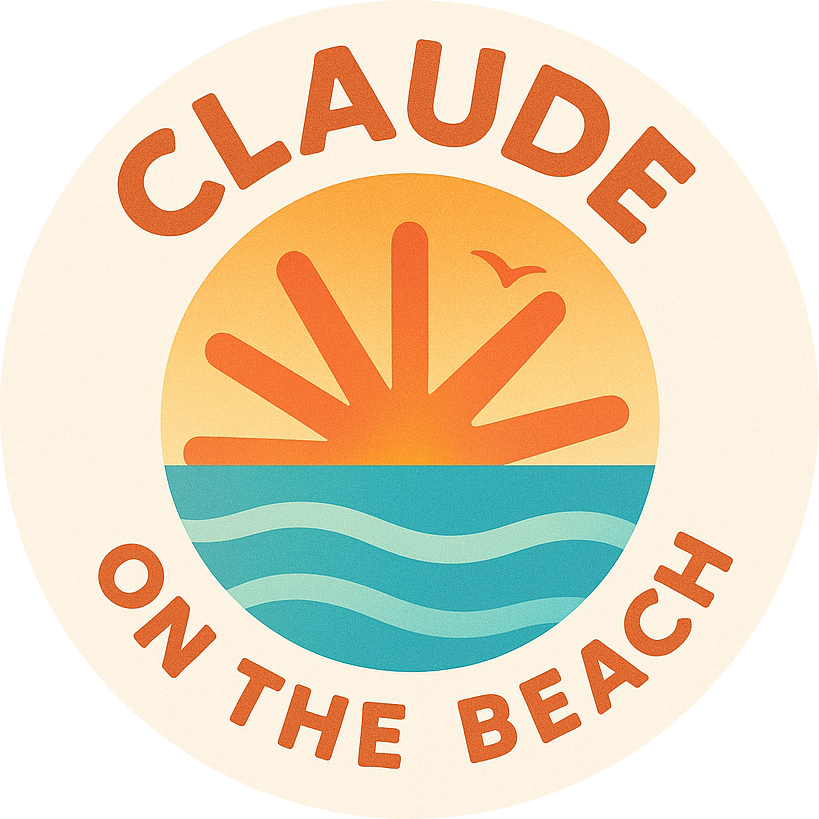

# 🏖️ Claude On The Beach 🌊

<p align="center">
  
</p>

## 🎥 Demo Video

Watch ClaudeOnTheBeach in action! See how easy it is to control your Claude Code terminal from anywhere:

### 🎬 Watch the Demo
<div>
  <a href="https://www.loom.com/share/d303677488d648739184a1a84f3adc0a">
    <p>Claude on the Beach - Demo - Watch Video</p>
  </a>
  <a href="https://www.loom.com/share/d303677488d648739184a1a84f3adc0a">
    
  </a>
</div>

**Click above to watch the full demo video on Loom** 🎥

*Remote terminal control via Telegram - code from anywhere!* 🏖️💻

Control Claude Code from anywhere - even the beach! Watch output in real-time and send commands remotely via Telegram.

**Why code from the office when you can code from the sand?** 🏝️ 🇬🇷✨

## 🌊 Features

- 🏄 **Remote Control** - Control Claude from anywhere with Telegram
- 📸 **Screenshots** - Take terminal screenshots remotely
- 🎬 **Video Recording** - 20-minute rolling recording buffer
- 🧠 **Smart Detection** - Intelligent task completion and question detection *(requires Claude API key)*

## 📋 Prerequisites

- **Python 3** with pip
- **Telegram** account
- **[Claude Code CLI](https://docs.anthropic.com/claude/docs/claude-code)** installed
- **Claude API Key** - [Get one here](https://console.anthropic.com/)
- **macOS** (client only - server runs on any OS)

## 🛠️ Quick Setup

### 1. Install Dependencies
```bash
# Install client dependencies
cd client && pip install -r requirements.txt && cd ..
```

### 2. Configure Environment
```bash
# Required: Add Claude API key for intelligent analysis
echo "ANTHROPIC_API_KEY=your_claude_api_key" > .env
```

**🔑 Claude API Key Required:**
The Claude API key enables intelligent screenshot analysis, task completion detection, and question analysis. [Get one here](https://console.anthropic.com/).

## 🚀 Quick Start

### Run the Client
```bash
python3 client/claudeOnTheBeach.py

# Optional: Specify directory
python3 client/claudeOnTheBeach.py --directory ~/myproject

# Optional: Use custom server
python3 client/claudeOnTheBeach.py --server ws://localhost:8081/ws

# Optional: Skip API key check (not recommended - LLM features disabled)
python3 client/claudeOnTheBeach.py --skip-api-check
```

### Connect via Telegram
1. Find @ClaudeOnTheBeach_bot on Telegram
2. Send `/start`
3. Send the pairing code from terminal
4. Start controlling Claude remotely!

## 📱 Available Commands

### Basic Commands
- `/s` or `/sc` - Take screenshot
- `/r` or `/rec` - Get 20-minute recording
- `/t` or `/status` - Check connection
- `/h` or `/help` - Show all commands
- `/d` or `/disconnect` - End session

### Navigation Commands
- `/c vv>e` - Send keyboard commands (down, down, right, enter)
- `//help` - Run Claude's help command
- Any text - Send to Claude as input


## 🐛 Troubleshooting

### Bot Not Responding
- Ensure you're using @ClaudeOnTheBeach_bot on Telegram
- Try `/start` command in Telegram
- Check your internet connection


## 🔒 Security

- Pairing codes expire after 30 minutes
- Sessions auto-cleanup after 2 hours
- No sensitive data stored
- All communication is session-based
- **Check out the server code**: [server/index.js](server/index.js) - Full transparency on how your data is handled


## 🛠️ For Developers

Want to run your own server? See [`server/README.md`](server/README.md) for detailed setup instructions.

**💡 Server Platform Support:**
- ✅ **Windows** - Full Node.js support
- ✅ **macOS** - Full Node.js support  
- ✅ **Linux** - Full Node.js support
- ✅ **Docker** - Cross-platform deployment
- ✅ **Cloud platforms** - Railway, Heroku, AWS, etc.

## 🎉 Why This is Awesome

Control Claude Code from anywhere - even the beach! 🏖️✨

- 📱 **Check output** - See what Claude is doing in real-time
- 🎬 **Watch recordings** - 20-minute rolling buffer of activity
- 📸 **Take screenshots** - Capture the current state
- ⌨️ **Send commands** - Tell Claude what to do next

**Code from anywhere, control from everywhere!** 📱💻

## 📝 License

MIT

---

**Created for controlling Claude Code remotely.** Enjoy coding from anywhere! 📱✨

*Made with 🇬🇷 Greek ingenuity - because we take the simple and make it even more convenient!* 🏖️
